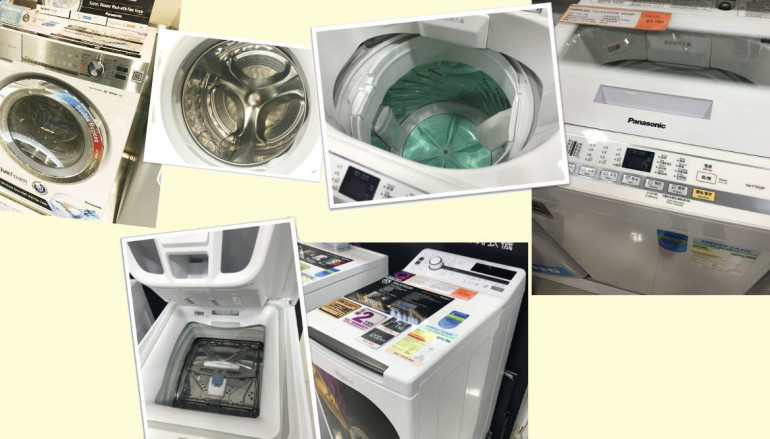
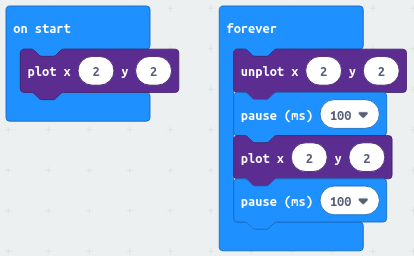
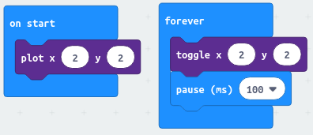

[//]: # "slide Markdown for remark"

class: center, middle

# micro:bit course

## Season 1 Lesson 1

## Introduction

???
Speaker notes
_Markdown_ also available here

---

# Hello

- I'm 李 Sir
- Rules in the class

---

# Agenda

- Introduction
- Computing Devices
- Play with MakeCode

---

name: intro

# Introduction

- computing devices is part of our daily life
- _computational thinking_ is an effective way to solve problems
- _micro:bit_ is a cheap yet powerful development board
- developed by BBC for computer literacy of school children
- we will use _micro:bit_ board to interact with the physical world

---

# Goals

- **learn to code and code to learn**  
  promote _computer literacy_ and _computational thinking_  
  most child knows how to _consume content_ on computer  
  but not using it as a tool to solve problems (or create games!)
- **physical computing**  
  interact with real world through software you wrote
- **applications of computing**  
  learn how everyday products are made
- **boost creativity**
- **have fun**

???

- [Intro to CS - Microsoft MakeCode](https://makecode.microbit.org/courses/csintro)
- [Projects - Microsoft MakeCode](https://makecode.microbit.org/projects)
- [microbit for primary schools – Schemes of work, lesson plans and resources for teachers](http://mb4ps.co.uk/)

---

class: center, middle

# Computing Devices

---

# Examples

.row[
.col-6[
.img-100[

]
]

.col-6.center[
.img-100[

]
LEGO Boost
]
]

---

# LEGO Boost Internals

.row[
.col-6[
.img-100[

]
]

.col-6[
.img-100[

]
]
]

---

# Examples

.img-50[

]

.img-50[

]

---

# Apple Watch Internals

.img-100[

]

---

# Examples

.img-50[

]

.img-50[

]

.footnote[
[Samsung Family Hub 2.0 Smart Fridge - YouTube](https://www.youtube.com/watch?v=AaKh5qJrTKQ)  
[洗衣機暗藏 STEM 洗衣機暗藏 STEM - PCM](https://www.pcmarket.com.hk/2018/10/11/洗衣機暗藏-stem/)
]

---

# Washing Machine Internals

.img-100[

]

---

# Computing Device

.small[

|    Microcontroller (微控制器)    |    Microprocessor (微處理器)    |
| :------------------------------: | :-----------------------------: |
|          single purpose          |         general purpose         |
| interact with motors and sensors | better user interface for human |
|        consume less power        |       consume more power        |
|  simple OS, cannot install apps  | full-blown OS, can install apps |

]

.footnote[
OS - Operating System (操作系統)
]

---

# Why do they behave differently?

.row[
.col-6[
.img-100[

]
]

.col-6[
.img-100[

]
]
]

.row[
.img-50[

]
]

---

# With Programs (程序)

.img-100[

]

---

# Programing for Kids

.small[
Programs are Software (軟件)
that get installed on Hardwares (硬件)
]

.img-100[

]

---

# Course Format

- **Components, Technology and Theory**

--

- **Make**  
  build the hardware circuit  
  _on upcoming lessons_

--

- **Code**  
  form problem statement (describe the problem)  
  plan on how to solve problem  
  programming: actual coding

--

- **Discussion**  
  what the application of the technology is

---

# Playing with MakeCode

- [Microsoft MakeCode for micro:bit](https://makecode.microbit.org/)
- there are tutorials and sample projects on landing page  
  we'll not be using them for now
- create a new project and enter the editor

.footnote[
[Intro | BBC micro:bit Lesson #0 | Adafruit Learning System](https://learn.adafruit.com/bbc-micro-bit-lesson-number-0?view=all#javascript-blocks-editor)
]

---

# MakeCode Interface

.row[
.col-10.offset-1[
.img-100[

]
]
]

.row[
.col-4[

micro:bit Simulator
]

.col-4[

Blocks pool
]

.col-4[

Coding area
]
]

---

# Chinese Interface

.row[
.col-4.offset-1[
.img-100[

]
]

.col-7[

1. Click the Cog (齒輪) and select "Language"
2. Select "繁体中文" near the bottom
   ]
   ]

---

# Let's check the blocks

- blocks are like LEGO, they snap together
- block categorized by feature (called _package_ or _library_)
- go through blocks in "Basic"  
  click "more" to show more "Basic" blocks
- viewing documentations
  1. mouse hover on the block
  2. Right Click -> Help
- [Reference - Microsoft MakeCode](https://makecode.microbit.org/reference)

---

# Types of blocks

- we can also classify blocks by how they behaves
- statement
- value
- boolean value (true/false)
- event handler/listener

--

- note they have different _shapes_
- check blocks in "Loops" and "Logic"  
  what are they?

---

# Showing string

.blockquote[
.title[Coding Plan]

```
show you name on LED screen
```

]

- use `basic.showString()`
- put it in "on start" or "forever"?

.footnote[
[Program: name](https://makecode.microbit.org/_f2fbKEYH0Vpr)
]

---

# Buttons

.blockquote[
.title[Coding Plan]

```
show "A" on LED screen when A button is pressed
show "B" on LED screen when B button is pressed
```

]

- Right click on block for actions
- Keyboard shortcut for
  - Delete <kbd>Del</kbd>
  - Copy and Paste <kbd>Ctrl</kbd>+<kbd>C</kbd>, <kbd>Ctrl</kbd>+<kbd>V</kbd>
  - Undo <kbd>Ctrl</kbd>+<kbd>Z</kbd>

.footnote[
[Program: buttons](https://makecode.microbit.org/_4vLVPtKpsWFk)
]

---

# Polling vs Event Handling

- `input.onButtonPressed(Button.A)` vs `input.buttonIsPressed(Button.A)`

--

.img-100.center[

]

- `onButtonPressed()` register an event listener  
  micro:bit can do other works while waiting for the event
- checking `buttonIsPressed()` in `forever()`  
  is what we called a _busy loop_  
  we should avoid them, or at least add some pause between the loop

???
analogy of waiting for you favorite TV show, you'll wait for the theme song rather than checking the TV every second

---

# Make a Counter

.blockquote[
.title[Coding Plan]

```
create a counter that starts with 0
show the counter on LED screen
decrease counter by 1 when A button is pressed
increase counter by 1 when B button is pressed
```

]

- we need to store the counter as a _variable_ (變量)
- which blocks to use?

.footnote[
[counter challenges - Microsoft MakeCode](https://makecode.microbit.org/lessons/counter/challenges)  
[Program: counter](https://makecode.microbit.org/_82q91f8Jcfqg)
]

---

# Make a Counter: Advanced

.blockquote[
.title[Coding Plan]

```
based on counter
limit the counter to 0-5
```

Hint: use `if`

]

.footnote[
[Program: counter-bound](https://makecode.microbit.org/_3r209VfJM0sd)
]

---

# Saving your Project

- projects saved in the browser  
  reuse on same machine without clearing browser data
- <kbd>Download</kbd> allow you to save the project as `.hex`
- <kbd>Save</kbd> (besides the project name) does similar thing  
  without the dialog for downloading to micro:bit
- the `.hex` is also the program to be put on micro:bit
- import from `.hex`  
  use <kbd>Import</kbd> _or_  
  drag and drop to MakeCode interface

---

# Tips for Working on

# Embedded Systems

- code _as much as possible_ on PC
- embedded system (嵌入式系統) is slow
- downloading to it takes time
- MakeCode provides an excellent simulator to run code

???
possible break

---

# Dot Matrix

.row[
.col-5[

]

.col-7[
.blockquote[
.title[Coding Plan]

```
show a heart on screen
(micro:bit loves you)
```

]
]
]

.footnote[
Hint: `basic.showIcon()`/`basic.showLeds()`
]

---

# Animation

- animation is a sequence of images
- we can make our own animation on micro:bit
- `basic.showLeds()` allows us to draw custom image

.blockquote[
.title[Coding Plan]

```
draw a body on screen
make it move
```

]

.footnote[
[Flashing Heart - Microsoft MakeCode](https://makecode.microbit.org/projects/flashing-heart)  
[Program: animation](https://makecode.microbit.org/_8kTXe207qgf2)
]

---

name: dot-matrix

# Dot Matrix

.row[
.col-5[

]

.col-7[

```
+--------------------------> x
| (0,0) (1,0) (2,0) (3,0) (4,0)
|
| (0,1) (1,1) (2,1) (3,1) (4,1)
|
| (0,2) (1,2) (2,2) (3,2) (4,2)
|
| (0,3) (1,3) (2,3) (3,3) (4,3)
v
y (0,4) (1,4) (2,4) (3,4) (4,4)
```

]

- we can also access individual LED
- `x` increases from 0 to 4 to the right
- `y` increases from 0 to 4 to the pins
- we often count from 0 in programming  
  so minus one to access the LED when counting from 1
  ]

---

# Blinking LED

.blockquote[
.title[Coding Plan]

```
turn on LED at (2,2)
turn off LED at (2,2)
repeat this pattern
```

]

- browse through the blocks in "LED" to see what's useful

--

.footnote[
Hints:

- there are multiple ways, try `plot()`/`unplot()` and `toggle()`
- micro:bit is blinking too fast, slow it down so we can see
  ]

???
code before showing hint

---

# Blinking LED

.row[
.col-6[
.img-100[

]
]

.col-6[
.img-100[

]
]
]

- there's more than one way to archive the goal
- micro:bit is blinking too fast  
  we have to add sleep so we can see

.footnote[
[Program: blinking-led-1](https://makecode.microbit.org/_ayUF2t5oTUTC)  
[Program: blinking-led-2](https://makecode.microbit.org/_isWYerge6PTd)
]

---

# Turn on LED 1 by 1

.blockquote[
.title[Coding Plan]

```
turn on LED one at a time
from left to right, top to bottom
```

]

--

- the dumb way

--

- use loops

???
do dump way first

---

# Loops

- notice the "from ... to" wording in our plan  
  this suggest use of loop
- go through blocks in "Loops"
- remember the range for indexing [Dot Matrix](#dot-matrix)

.footnote[
[Program: matrix-for-loop](https://makecode.microbit.org/_aDo9v7f6hDEv)
]

---

# Breathing LED

.blockquote[
.title[Coding Plan]

```
LED at (2,2) start from dim and glows
repeat this pattern
```

]

- browse through the blocks in "LED"
- also check "more"

.footnote[
[Program: breathing_led_2](https://makecode.microbit.org/_hH2dD9MHRYpy)
]

???
show demo before coding

---

# Breathing LED

.row[
.col-6[
.img-100[

]
]

.col-6[
.img-100[

]
]
]

- note the trick of `led.setBrightness(0)` before drawing
- we also have to add sleep, otherwise the LED is just blinking

.footnote[
do add pauses after changing the brightness, otherwise matrix will flicker  
[Program: breathing_led_1](https://makecode.microbit.org/_dhPWXT6rjHkR)  
[Program: breathing_led_2](https://makecode.microbit.org/_hH2dD9MHRYpy)
]

---

# Breathing LED

.row[
.col-6[
.img-100[

]
]

.col-6[
.img-100[

]
]
]

- What's the difference?  
  `led.plotBrightness(x, y, brightness)`  
  `led.setBrightness(brightness)`

--

- We're only have way done  
  How to "exhale" (dimming the LED gradually)?

---

# Reverse the Sequence

- we've been increasing `brightness` with `for`
- how to make a decreasing sequence from increasing one?

--

.img-75.center[

]

---

# Reverse the Sequence

- we've been increasing `brightness` with `for`
- how to make a decreasing sequence from increasing one?

.img-75.center[

]

---

# Reverse the Sequence

- we've been increasing `brightness` with `for`
- how to make a decreasing sequence from increasing one?
- how about a longer sequence?

.img-75.center[

]

---

# Breathing Heart

.blockquote[
.title[Coding Plan]

```
show a heart on LED screen
apply breathing pattern to it
```

]

.footnote[
Hint: do add pauses after changing the brightness, otherwise the screen will flicker  
[Program: breathing-heart](https://makecode.microbit.org/_TE5W7VFdo837)
]

---

# [Bonus] Blocks in "Game"

.blockquote[
.title[Coding Plan]

```
create a sprite the moves back and froth in the middle row
when it is at the center of the screen, use A button to capture it
keep the score and play for 15 seconds
```

]

We'll program more games in L3 😊.

.footnote[
[Snap the Dot - Microsoft MakeCode](https://makecode.microbit.org/v1/projects/snap-the-dot)  
[Program: snap-the-dot](https://makecode.microbit.org/76542-48458-63081-91598)
]

---

# Conclusion

- introduced to some common computing devices
- coding in MakeCode
- we can do a lot just using the simulator in MakeCode
