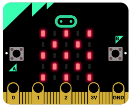
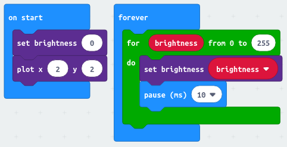
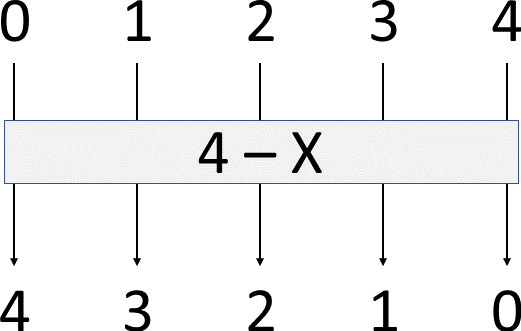

[//]: # "slide Markdown for remark"

class: center, middle

# micro:bit course

## Season 1 Lesson 1

## Extra Materials

???
Speaker notes
_Markdown_ also available here

---

# Dot Matrix

.row[
.col-5[

]

.col-7[
.blockquote[
.title[Coding Plan]

```
show a heart on screen
(micro:bit loves you)
```

]
]
]

.footnote[
Hint: `basic.showIcon()`/`basic.showLeds()`
]

---

# Animation

- animation is a sequence of images
- we can make our own animation on micro:bit
- `basic.showLeds()` allows us to draw custom image

.blockquote[
.title[Coding Plan]

```
draw a body on screen
make it move
```

]

.footnote[
[Flashing Heart - Microsoft MakeCode](https://makecode.microbit.org/projects/flashing-heart)  
[Program: animation](https://makecode.microbit.org/_8kTXe207qgf2)
]

---

name: dot-matrix

# Dot Matrix

.row[
.col-5[

]

.col-7[

```
+--------------------------> x
| (0,0) (1,0) (2,0) (3,0) (4,0)
|
| (0,1) (1,1) (2,1) (3,1) (4,1)
|
| (0,2) (1,2) (2,2) (3,2) (4,2)
|
| (0,3) (1,3) (2,3) (3,3) (4,3)
v
y (0,4) (1,4) (2,4) (3,4) (4,4)
```

]

- we can also access individual LED
- `x` increases from 0 to 4 to the right
- `y` increases from 0 to 4 to the pins
- we often count from 0 in programming  
  so minus one to access the LED when counting from 1
  ]

---

# Turn on LED 1 by 1

.blockquote[
.title[Coding Plan]

```
turn on LED one at a time
from left to right, top to bottom
```

]

--

- the dumb way

--

- use loops

???
do dump way first

---

# Loops

- notice the "from ... to" wording in our plan  
  this suggest use of loop
- go through blocks in "Loops"
- remember the range for indexing [Dot Matrix](#dot-matrix)

.footnote[
[Program: matrix-for-loop](https://makecode.microbit.org/_aDo9v7f6hDEv)
]

---

# Breathing LED

.blockquote[
.title[Coding Plan]

```
LED at (2,2) start from dim and glows
repeat this pattern
```

]

- browse through the blocks in "LED"
- also check "more"

.footnote[
[Program: breathing_led_2](https://makecode.microbit.org/_hH2dD9MHRYpy)
]

???
show demo before coding

---

# Breathing LED

.row[
.col-6[
.img-100[

]
]

.col-6[
.img-100[

]
]
]

- note the trick of `led.setBrightness(0)` before drawing
- we also have to add sleep, otherwise the LED is just blinking

.footnote[
do add pauses after changing the brightness, otherwise matrix will flicker  
[Program: breathing_led_1](https://makecode.microbit.org/_dhPWXT6rjHkR)  
[Program: breathing_led_2](https://makecode.microbit.org/_hH2dD9MHRYpy)
]

---

# Breathing LED

.row[
.col-6[
.img-100[

]
]

.col-6[
.img-100[

]
]
]

- What's the difference?  
  `led.plotBrightness(x, y, brightness)`  
  `led.setBrightness(brightness)`

--

- We're only have way done  
  How to "exhale" (dimming the LED gradually)?

---

# Reverse the Sequence

- we've been increasing `brightness` with `for`
- how to make a decreasing sequence from increasing one?

--

.img-75.center[

]

---

# Reverse the Sequence

- we've been increasing `brightness` with `for`
- how to make a decreasing sequence from increasing one?

.img-75.center[

]

---

# Reverse the Sequence

- we've been increasing `brightness` with `for`
- how to make a decreasing sequence from increasing one?
- how about a longer sequence?

.img-75.center[

]

---

# Breathing Heart

.blockquote[
.title[Coding Plan]

```
show a heart on LED screen
apply breathing pattern to it
```

]

.footnote[
Hint: do add pauses after changing the brightness, otherwise the screen will flicker  
[Program: breathing-heart](https://makecode.microbit.org/_TE5W7VFdo837)
]
