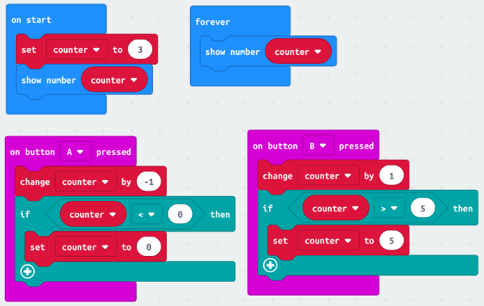
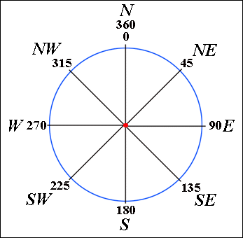
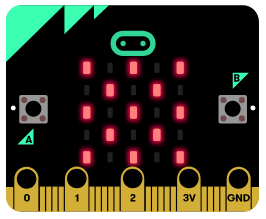
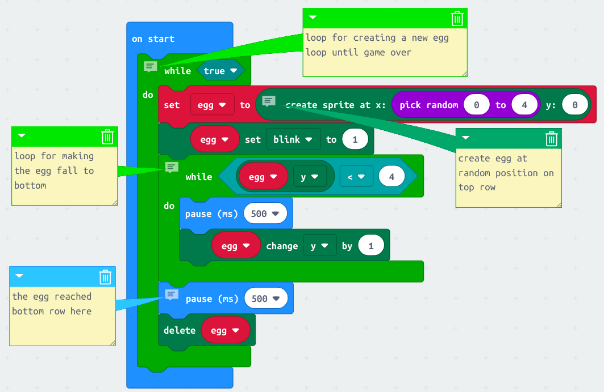
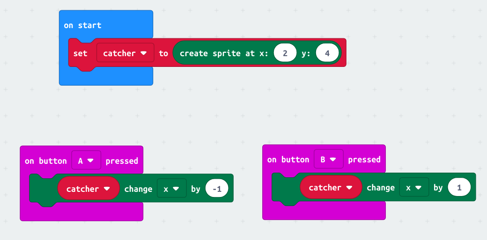
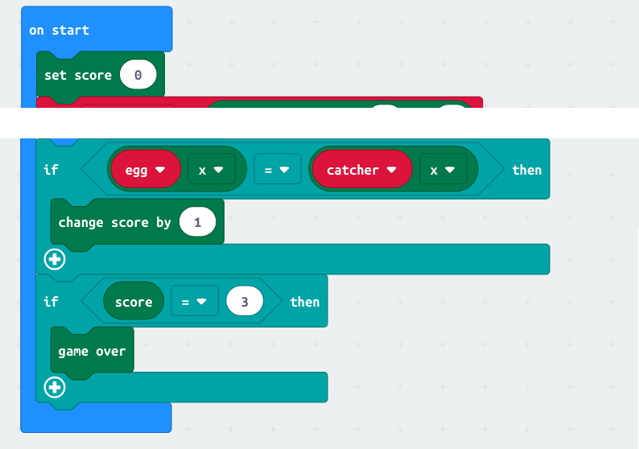
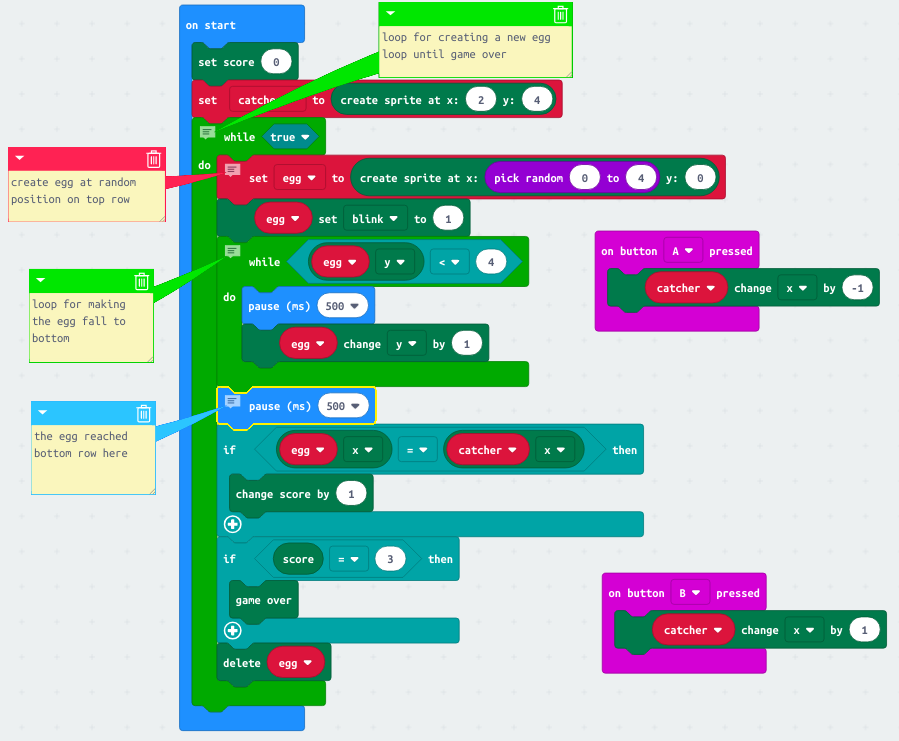
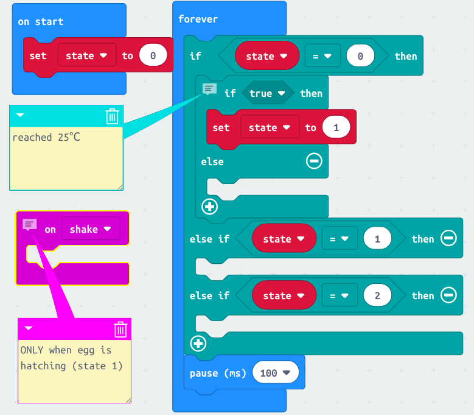

[//]: # "slide Markdown for remark"

class: center, middle

# micro:bit course

## Season 1 Lesson 2

## Learn your micro:bit

???
Speaker notes
_Markdown_ also available here

---

# Agenda

- Revision of L1
- micro:bit board
- micro:bit sensors
  - light sensor
  - temperature
  - magnetometer
  - accelerometer

---

# We've learnt

--

- "on start" vs "forever"  
  use forever when things change
- show string
- show number
- buttons
- variable
- `if` block

---

# Make a Counter: 進階版

.img-100.center[

]

.footnote[
[Program: counter-bound](https://makecode.microbit.org/_EYJ5KwM2v25J)
]

---

# micro:bit 硬件

- 檢視 micro:bit 板上的不同芯片
- [Take a Tour! | BBC micro:bit Lesson #0 | Adafruit Learning System](https://learn.adafruit.com/bbc-micro-bit-lesson-number-0/take-a-tour)

---

# 加速度計 (Accelerometer)

- 量度 micro:bit 的加速度(acceleration)
- 亦可以用於檢測傾斜度(inclination)
- 由於*地心吸力*, 在地表上物體都有一個向地心的加速度
- 如果物體有所傾斜, 該加速度的改變是可以量度出來的

---

# 睡著的 micro:bit

.blockquote[
.title[Coding Plan]

```
正面朝上時顯示睡著臉
傾斜時顯示笑臉(或其他圖示)
```

]

.footnote[
[Program: sleeping](https://makecode.microbit.org/_HV0PL2b4uWCv)
]

---

# 嵌入式系統 開發貼士

- _盡量用_ MakeCode 環境來編程
- 嵌入式系統 (embedded system) 比較慢
- 下載亦需時
- MakeCode 環境提供了一個非常棒的 micro:bit 模擬器(simulator)來跑代碼

---

# 儲存你的專案

- 專案(Project) 就是你的代碼, 它們儲在你的瀏覧器內  
  如果你用同一部機器而沒有清空瀏覧器數據的話, 你可以沿用你的專案
- <kbd>Download</kbd> 讓你下載專案為`.hex`檔
- <kbd>Save</kbd> (專案名旁的磁碟圖案)同樣讓你下載  
  但沒有複制到 micro:bit 的提示
- `.hex`檔除了可放 micro:bit, 亦是整個專案(包含你的代碼)
- 匯入`.hex`:  
  <kbd>Import</kbd> _或_  
  拖放`.hex`檔到 MakeCode 介面

---

# 加速度計應用

- 智能手錶在你提手時開啟屏幕
- 自由落體偵測, 在保障人身安全時十分有用  
  電梯都裝有加速度計, 自由落體時啟動減速裝置  
  監控老人小童的家居意外

---

class: center, middle

# 亙動故事

現在你是一個尋找珍獸的探險家  
我們用 micro:bit 來編成一個亙動故事吧

---

# 指南針

.blockquote[
.title[Coding Plan]

探險當然要先準備指南針

```
用 micro:bit 顯示你面對的方向 (N, E, S, W)

挑戰: 多加四個方向 (NE, SE, SW, NW)
挑戰: 令箭咀一正指向北, 而不是你面對的方向
```

]

.footnote[
[Compass Heading - Microsoft MakeCode](https://makecode.microbit.org/reference/input/compass-heading)
]

---

# 指南針

.row[
.col-6[

]
.col-6[
用 micro:bit 的方位感測可以取得面對方向的方位角

跟據不同的方位⻆顯示對應的圖示
]
]

.footnote[
[Program: compass](https://makecode.microbit.org/_bzTAb3U7gb3h)
]

---

name: dot-matrix

# Dot Matrix

.row[
.col-5[

]

.col-7[

```
+--------------------------> x
| (0,0) (1,0) (2,0) (3,0) (4,0)
|
| (0,1) (1,1) (2,1) (3,1) (4,1)
|
| (0,2) (1,2) (2,2) (3,2) (4,2)
|
| (0,3) (1,3) (2,3) (3,3) (4,3)
v
y (0,4) (1,4) (2,4) (3,4) (4,4)
```

]

- we can also access individual LED
- `x` increases from 0 to 4 to the right
- `y` increases from 0 to 4 to the pins
- we often count from 0 in programming  
  so _minus one_ to the value when counting from 1
  ]

---

# 遊戲: 接蛋

珍獸的蛋在山上跌下來了, 趕快把它們接住

.blockquote[
.title[Coding Plan]

```
用一個由上而下跌的LED 點來表示蛋
嘗試接蛋的玩家則用另一點(在最下一行)來表示
A 鍵: 玩家向左移
B 鍵: 玩家向右移
接3隻蛋來結束遊戲
```

]

---

# 遊戲: 接蛋

.row[
.col-8.offset-2[

<div style="position:relative;height:0;padding-bottom:81.97%;overflow:hidden;"><iframe style="position:absolute;top:0;left:0;width:100%;height:100%;" src="https://makecode.microbit.org/---run?id=_MPP3e8gEs3cY" allowfullscreen="allowfullscreen" sandbox="allow-popups allow-forms allow-scripts allow-same-origin" frameborder="0"></iframe></div>
]
]

---

name: divide-and-conquer

# 分而治之 (Divide and Conquer)

面對複雜問題, 我們嘗試把它分拆為易解的小問題

我們把接蛋遊戲分成 3 部分:

1. 下跌的蛋
2. 控制玩家
3. 記分

---

# 1. 下跌的蛋

.blockquote[
.title[Coding Plan]

```
創建變量`egg`為遊戲⻆色 (`game.createSprite()`)
讓它在第一行的隨機列出現 (x = random(0, 4), y = 0)
讓它閃爍(blink)來區分
每一步改變它的y 值1, 直到它到最下一行
在每一步前加一點延時 (`basic.pause()`)
當到最下一行時刪除⻆色
一直重覆這模式 (`game.gameOver()`自會結束遊戲)
```

]

.footnote[
[Dot Matrix](#dot-matrix)
]

---

# 1. 下跌的蛋

.img-100[

]

.footnote[
[Skeleton: catching-eggs-1](https://makecode.microbit.org/_Lrjg7aKEWL6r)
]

---

# 2. 控制玩家

.blockquote[
.title[Coding Plan]

```
創建變量`catcher`為遊戲⻆色 (`game.createSprite()`)
讓它在最下一行中間出現 (x = 2, y = 4)
用A, B鍵改變`catcher`的x值來做到左右移動
Game庫的"change by"已經會限制變量x在0到4的範圍內
(還記得我們在Counter進階版要自已寫代碼設限制嗎?)
```

]

.footnote[
[Dot Matrix](#dot-matrix)
]

---

# 2. 控制玩家

.img-100[

]

.footnote[
[Skeleton: catching-eggs-2](https://makecode.microbit.org/_2e4hUohfRCLD)  
比較 [counter-bound](https://makecode.microbit.org/_EYJ5KwM2v25J)
]

---

# 3. 記分

.blockquote[
.title[Coding Plan]

```
一開始設得分(score)為0
當`egg`到達最下一行:
- 檢查它有否跟`catcher`重疊 (檢查它們的x是否相等)
  如果是的話得分加1
- 檢查得分是否等於3
  如果是的話結束遊戲
```

]

---

# 3. 記分

.img-75.center[

]

---

# 遊戲: 接蛋 (完成)

.img-75.center[

]

.footnote[
[Program: catching-eggs](https://makecode.microbit.org/_MPP3e8gEs3cY)
]

---

# 接蛋: 挑戰

.blockquote[
.title[Coding Plan]

```
挑戰:
如果玩家接不到蛋時扣分, 得分為-3時結束遊戲
如果玩家接到蛋時提升遊戲速度
```

]

---

# 遊戲: 孵蛋

好不容易保護到珍獸的蛋, 它看起來沉甸甸的, 好像要孵化了

.blockquote[
.title[Coding Plan]

```
一開始顯示一個蛋圖案
當溫度大於25℃, 顯示一隻在孵化的蛋
如果蛋正在孵化, 在晃動時顯示珍獸圖案
設計你的圖案吧
孵化其他人的蛋, 看看他們的珍獸
```

]

.footnote[
Hint: 我們要一個記錄蛋的*狀態*
]

---

# 遊戲: 孵蛋

.img-75.center[

]

.footnote[
[Skeleton: hatching-egg](https://makecode.microbit.org/_DVLMuHc4e6rz)
]

---

# 編程概念

- 我們用了`state`變量來記錄蛋的*狀態*  
  按不同`state`的值我們做不同的事
- 0: 等待溫度升高時顯示蛋圖案
- 1: 等待晃動時顯示孵化的蛋圖案
- 2: 蛋孵化了, 顯示珍獸
- Game 庫的"得分"亦是一個狀態

.footnote[
[Program: hatching-egg](https://makecode.microbit.org/_Jq21Xu5ep3s4)
]

---

# 孵蛋: 挑戰

.blockquote[
.title[Coding Plan]

```
挑戰:
按A+B鍵來重設遊戲
```

]

---

# 總結

- micro:bit 有不少內置的感應器
- Game 庫可以協助我們編寫遊戲
- 遊戲中是怎樣用到不同的邏輯  
  state 狀態, if 如果, and 且, loops 迴圈
- 時間流逝本身亦是一種狀態
- 把複雜問題分拆為易解的[小問題](#divide-and-conquer)
