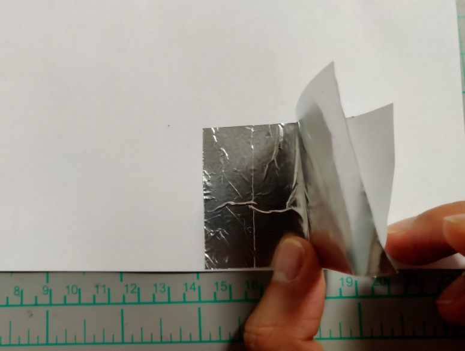
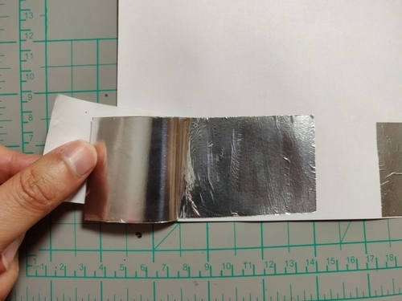
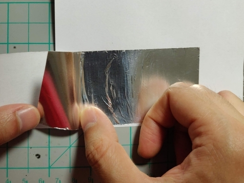
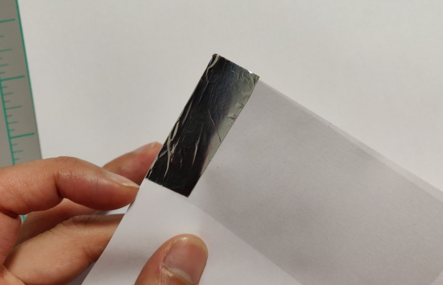
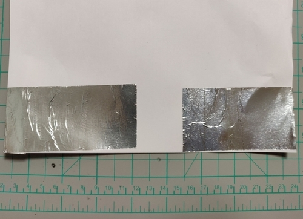
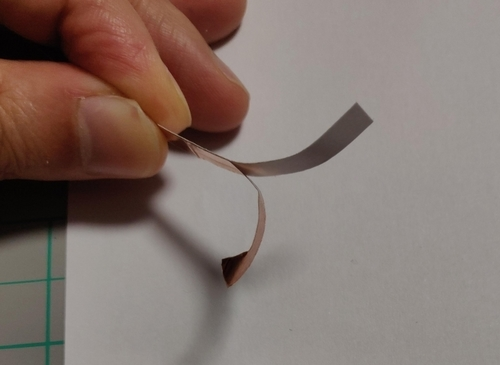
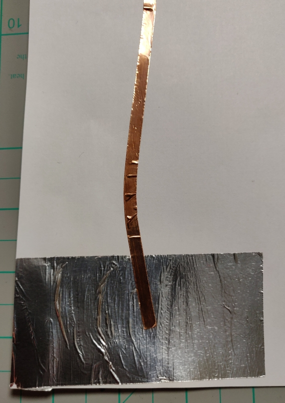
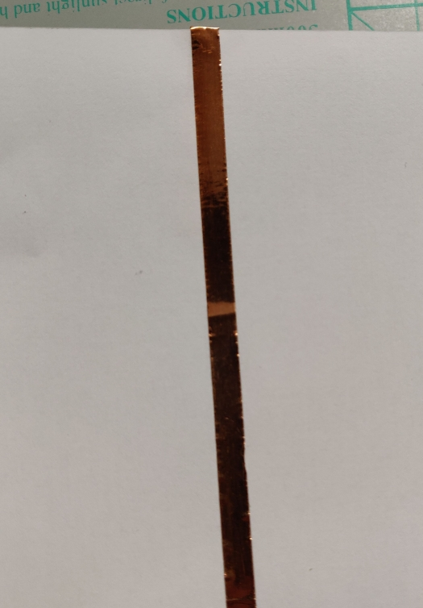
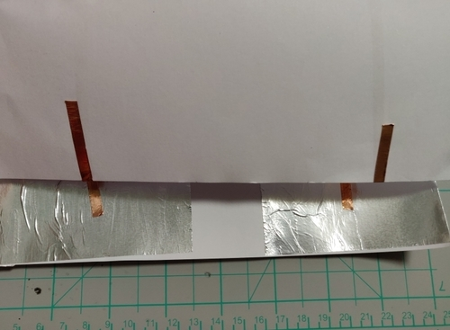

[//]: # "slide Markdown for remark"

class: center, middle

# micro:bit course

## Season 1 Lesson 3

## Electric Circuits

???
Speaker notes
_Markdown_ also available here

---

# 大綱

- 電路
- 紙電路
- 遊戲: 考反應

---

# Multimeter

- 示範

--

- 萬用表

???
multi?
meter?

---

class: center, middle

# 簡陋萬用表

---

# 擴展板

- 我們的擴展板上有一個蜂鳴器(buzzer)
- micro:bit 的`Pin 0`可以發信號讓它發出不同音調
- 亦因此我們用擴展板時要避免使用`Pin 0`
- 擴展板上所有 3V 和 GND 都是一樣的

---

# 簡陋萬用表

.blockquote[
.title[Make]

```
用兩跟公對母杜邦線分別連到Pin 1及3V
用它個公頭的針來測試導電能力
```

.title[Code]

```
讀取Pin 1的數碼信號
如果是1 (即是高電壓), 用蜂鳴器發出聲響及顯示一個圖示
否則關閉蜂鳴器及顯示一個預設圖示
```

]

.footnote[
[Program: multimeter](https://makecode.microbit.org/_36JcoJY2V87K)
]

---

class: center, middle

# 紙電路

---

# 紙電路

- 我們的導電銅貼用了導電的粘貼劑, 所以是雙面導電的  
  (亦因為這原因比單面導電的貴一點 <i class="fas fa-dollar-sign"></i><i class="fas fa-dollar-sign"></i>)
- **小心短路 (short circuit)**  
  短路是.red[危險]的  
  電線及零件會快速升溫, 可能導致損壞

.footnote[
[Using Copper Tape with Paper Circuits - Tutorial Australia](https://core-electronics.com.au/tutorials/using-copper-tape-with-paper-circuits.html)  
[Working with Copper Tape and Paper to Craft Circuits - YouTube](https://www.youtube.com/watch?v=nKMhuQ2hq9E)
]

---

# 遊戲: 考反應

.blockquote[
.title[Make]

```
在A4紙底部左右分別貼上錫紙
用導電銅貼作線路把錫紙引到A4紙頂端
用多餘的導電銅貼把頂端底部亦覆蓋一少部份作連接用
用鱷魚夾連到頂端的導電銅貼和micro:bit的Pin 1及3V (不需要擴展板)
```

]

---

class: center, img-75



撕開尾端的底紙, 貼上 A4 紙  
一邊按壓一邊撕下底紙

---

class: center, img-75



另一邊同樣  
撕開尾端的底紙, 貼上 A4 紙  
一邊按壓一邊撕下底紙

---

class: center, img-75



一邊按壓一邊撕下底紙

---

class: center, img-75



如果有多餘的錫紙就貼到 A4 紙底部

---

class: center, img-75



完成兩塊錫紙

---

class: center, img-75



到導電銅貼, 亦是先撕開尾端的底紙

---

class: img-100

.row[
.col-6[

]
.col-6[
導電銅貼跟錫紙要有**重疊**

我們的雙面導電和錫紙會完成電路

貼歪了也不要緊, 慢慢修正就行
]
]

---

class: img-100

.row[
.col-6[

]
.col-6[
一邊按壓一邊撕下底紙

一直貼到頂部
]
]

---

class: center, img-75



導電銅貼最好有多餘部份貼到 A4 紙底部  
和鱷魚夾的接觸會好一些

---

# 遊戲: 考反應

.blockquote[

.title[Code]

```
玩家先放一隻手到錫紙上
按A開始遊戲
micro:bit由3倒數至1, 然後清空畫面
隨機延時後在LED 顯示圖案
micro:bit等待Pin 1類比信號大於700
玩家同時以最快反應把另一隻手放到另一塊錫紙上
micro:bit在類比信號為高後顯示反應時間
```

]

.footnote[
[Skeleton: reaction](https://makecode.microbit.org/_hTmccsEgWKo8)  
這裡的 700 是一個*閾值*(threshold), 是測量出來的  
連上紙電路 Pin 1 的類比信號應該有 200-300, 玩家接觸兩塊錫紙後應該有 900  
如果接觸兩塊錫紙未能觸發的話就下調此閾值, 但不要少於 300
]

---

# 遊戲: 考反應

- 在代碼中用了`function`積木
- 目的是把一些相關的代碼抽出來, 方便閱讀及重用

.footnote[
[Program: reaction](https://makecode.microbit.org/_27YYg9e7MEvK)
]
