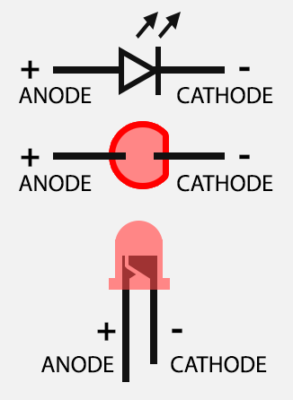

[//]: # "slide Markdown for remark"

class: center, middle

# micro:bit course

## Season 1 Lesson 4

## Electric Circuits 2

???
Speaker notes
_Markdown_ also available here

---

# 大綱

- 溫習
- 遊戲: 電流棒
- LED

---

# 溫習

- micro:bit 可以用來測量導電性能
- 我們可以用來製作遊戲
- 每次有不同的程序(或更新了程序), 我們都要下載到電腦再複製到 micro:bit

---

class: img-100

# 遊戲: 電流棒

.row[

.col-6[

]
.col-6[

- micro:bit
- micro:bit 擴展板
- 長短鐵線各 1 條
- 公對母杜邦線 2 條
- 鱷魚夾 2 個
- 泥膠

.red[小心鐵線剌傷手指]

]
]

.footnote[
[Frustration – Code Club](https://codeclubprojects.org/en-GB/microbit/frustration/)  
]

---

# 遊戲: 電流棒

.blockquote[
.title[Make]

```
把長鐵線隨意屈成迷宮狀
把短鐵線屈成線圈
把線圈穿入迷宮, 再用泥膠把迷宮固定到桌面上
2個鱷魚夾分別夾到線圈和迷宮尾端, 另一端夾到杜邦線公頭
2個杜邦線母頭就分別連到Pin 1 及3V
```

]

---

class: img-100

.row[

.col-6[

]
.col-6[

把長鐵線隨意屈成迷宮狀

.red[小心鐵線剌傷手指]

]
]

---

class: img-100

.row[

.col-6[

]
.col-6[

把短鐵線屈成線圈

.red[小心鐵線剌傷手指]

]
]

---

class: center, img-75


把線圈穿入迷宮, 再用泥膠把迷宮固定到桌面上

---

class: center, img-75


2 個鱷魚夾分別夾到線圈和迷宮尾端

---

class: img-100

.row[

.col-6[

]
.col-6[

鱷魚夾的另一端夾到杜邦線公頭

]
]

---

class: center, img-75


2 個杜邦線母頭就分別連到 Pin 1 及 3V

---

# 遊戲: 電流棒

.blockquote[
.title[Code]

```
創建變量`count`
如果Pin 1 的數位訊號是1, 即是線圈接觸到迷宮, 建成迴路時
- 在畫面顯示交叉
- 用蜂鳴器發出聲響
紀錄玩家接觸到迷宮的次數
```

]

.footnote[
[Program: frustration](https://makecode.microbit.org/_8JJWTT2a5bpv)
]

---

class: center, middle

# LED

---

# 面包板的起源

.center[

]

---

# 面包板

.center[


左右垂直的針孔相通  
橫向有兩組 5 個針孔, 每組內的針孔是相通, 但兩組互不相通
]

.footnote[
[Chapter 2: Using a breadboard | Arduino to Go](http://arduinotogo.com/2016/08/22/chapter-2-using-a-breadboard/)  
[How to Use a Breadboard - learn.sparkfun.com](https://learn.sparkfun.com/tutorials/how-to-use-a-breadboard)
]

---

# LED 的極性 (Polarity)

.row[
.col-6[
.img-100[

]
]

.col-6[

- LED 兩腳分別為**陽極(anode)**和**陰極(cathode)**
- 長腳一端為**陽極**  
  接高電壓 (3V 或 micro:bit 的 GPIO 針腳)
- 切平一端為**陰極**  
  接 GND
- 如果接線錯誤 LED 是不會亮著的

]
]

.footnote[
[Polarity - learn.sparkfun.com](https://learn.sparkfun.com/tutorials/polarity)
]

---

class: center, middle

# LED 接駁示範

---

# 遊戲: 電流棒 LED 版

.blockquote[
.title[物料]

- 電流棒物料
- LED 1 粒
- 公對母杜邦線 2 條

]

---

# 遊戲: 電流棒 LED 版

.blockquote[
.title[Make]

```
把LED 插到面包板上, 注意兩腳不能插在同一組
一條杜邦線的公頭插到陽極的一行, 母頭連到擴展板Pin 2
另一條杜邦線的公頭插到陰極的一行, 母頭連到擴展板GND
```

]

---

# 遊戲: 電流棒 LED 版

.blockquote[
.title[Make]

```
基於電流棒的程序
如果Pin 1 的數位訊號是1, 即是線圈接觸到迷宮, 建成迴路時
- 把Pin 2 的數位訊號設為1來亮著LED
- 顯示圖示後把Pin 2 的數位訊號設為0來關閉LED
```

]

.footnote[
[Program: frustration](https://makecode.microbit.org/_8JJWTT2a5bpv)  
[Program: frustration-led](https://makecode.microbit.org/_LrDH6fXWPUfU)
]
