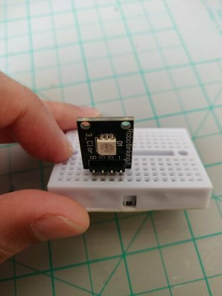
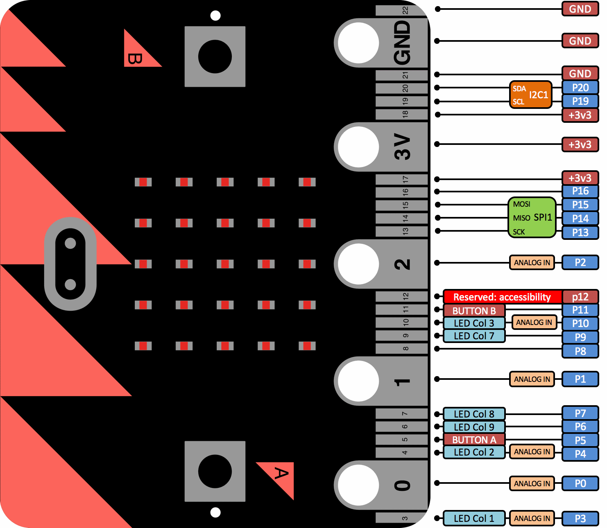

[//]: # "slide Markdown for remark"

class: center, middle

# micro:bit course

## Season 1 Lesson 5

## Playing with LED

???
Speaker notes
_Markdown_ also available here

---

# 大綱

- 溫習
- 複製顏色
  - RGB LED
- 交通燈
  - Neopixel

---

class: center, middle

# 溫習

---

# 擴展板

.row[
.col-6[
.img-100[

]
]

.col-6[

- .yellow-pin[黃色]是連到 micro:bit 作輸入/輸出用
- 所有.red-pin[紅色]都一樣是高電壓(3.3V)
- 所有.black-pin[黑色]都一樣是低電壓(GND/0V)

]
]

---

# 面包板的使用

.center[

]

- 垂直的針孔相通
- 橫向兩組每組內 5 針相通, 兩組互不相通
- 電子零件要連到不同組才能運作

---

# LED 的極性 (Polarity)

.row[
.col-6[
.img-100[

]
]

.col-6[

- LED 兩腳分別為**陽極(anode)**和**陰極(cathode)**
- 長腳一端為**陽極**  
  接高電壓 (3V 或 micro:bit 的 GPIO 針腳)
- 切平一端為**陰極**  
  接 GND
- 如果接線錯誤 LED 是不會亮著的

]
]

.footnote[
[Polarity - learn.sparkfun.com](https://learn.sparkfun.com/tutorials/polarity)
]

---

# 下載程序到 micro:bit

- 下載程序到 micro:bit

  1. 用 USB 線把 micro:bit 連接到電腦  
     請先用拇指、食指固定 micro:bit 上的 USB 底座才進行拔插，以免損壞底座
  2. 在 MakeCode 下載.hex 檔
  3. 把 .hex 檔複製到名為"MICROBIT"的存儲裝置下

- 每次有不同的程序(或更新了程序), 我們都要  
  重新下載到程序電腦, 再複製到 micro:bit

.footnote[
[快速入門 | micro:bit](https://microbit.org/hk/guide/quick/)
]

---

class: center, middle

# 複製顏色

---

class: center, middle

# RGB LED

---

# RGB 三原色

.row[
.col-6[
.img-100[

]
]

.col-6[

- 數碼色彩多數用 RGB 作為三原色
- 不同顏色以三原色不同的比例相加而生成
- 左圖是放大的 LCD 顯示屏  
  正在顯示橙色和藍色

]
]

.footnote[
[RGB color model - Wikiwand](https://www.wikiwand.com/en/RGB_color_model)  
[HTML Color Codes Chart](https://www.rapidtables.com/web/color/html-color-codes.html)
]

---

# 材料

.row[

.col-6[

]
.col-6[

- micro:bit
- micro:bit 擴展板
- 公對母杜邦線 4 條 1 組
- 5050 RGB LED 板
- 面包板

]
]

---

# Make

.blockquote[

```
把 5050 RGB LED 板插到面包板上, 垂直的佔著4個橫行
把 4 條 1 組的公對母杜邦線的公頭插到該 4 組橫行
把對應 B,G,R 的母頭插到 micro:bit 擴展板的 Pin 1, 8, 9 (黃色)上
把對應 - 的母頭插到 micro:bit 擴展板的任意一個GND 上

貼士:
插線時我們先記著一條靠邊針腳的杜邦線顏色, 其他順序插就可以
(所以 4 條 1 組比 4 條單獨的杜邦線方便處理和辨認針腳)
另外 - / GND 可選用比較深色的線, 更易認
```

]

---

class: center, img-75



把 5050 RGB LED 板插到面包板上

---

class: center, img-75


把 4 條 1 組的公對母杜邦線的公頭插到該 4 組橫行  
\- / GND 可選用比較深色的線, 更易認

---

class: img-100

.row[
.col-6[


]
.col-6[

- 把對應 B,G,R 的母頭分別插到 Pin 1, 8, 9 上
- 把對應 - 的母頭任意一個 GND 上
- 用杜邦線的顏色來辨認靠邊的針腳(這裡的黃色線), 其他順序插就可以
  ]
  ]

---

class: img-75

# Code

.center[

]

.footnote[
[Program: rgb-led](https://makecode.microbit.org/_5Az3ATLwY8Uf)
]

---

class: img-100

# 程序講解: micro:bit 針腳 (Pins)

.row[

.col-8[

]
.col-4[

- micro:bit 的針腳會被不同功能所分享
- A, B 鍵：5, 11
- LED 矩陣：3, 4, 6, 7, 9, 10
- I2C: 19, 20 (板上的温度, 加速和磁場傳感器)
- 這個程序用到了 Pin 9, 所以要關掉 LED 矩陣

]
]

---

# 程序講解: 擴展 (Extensions)

- 這程序用了 MakeCode 的"擴展"
- 簡化對 RGB LED 控制的代碼  
  好比"遊戲"積木簡化了編寫遊戲的代碼
- 在程序中加入擴展的步驟:
  1. 進階 (Advanced) -> 擴展 (Extensions)
  2. 輸入網址:  
     `seasonedbits/pxt-rgb-led`
  3. 在積木中看到 "RGB LED" 類別

.footnote[
[seasonedbits/pxt-rgb-led: Extension for RGB LED modules](https://github.com/seasonedbits/pxt-rgb-led)  
在 GitHub 的代碼可省略前半部份網址
]

---

class: center, middle

# TSC3200 顏色傳感器

---

class: img-100

# 材料

.row[

.col-6[

]
.col-6[

先前的材料:

- micro:bit
- micro:bit 擴展板
- 公對母杜邦線 4 條 1 組
- 5050 RGB LED 板
- 面包板

加上:

- 母對母杜邦線 4 條 2 組
- TSC3200 顏色傳感器

]
]

---

# Make

.blockquote[

```
把 4 條 1 組的母對母杜邦線插到左邊 GND ... S0 4 針
把 4 條 1 組的母對母杜邦線插到右邊 S3 ... VCC 4 針

把對應 S0, S1, OE 的另一母頭插到擴展板的 Pin 12, 2, 13 (黃色)
把對應 GND 的母頭插到 micro:bit 擴展板的任意一個 GND 上

把對應 S3, S3, OUT 的另一母頭插到擴展板的 Pin 14, 15, 16 (黃色)
把對應 VCC 的母頭插到 micro:bit 擴展板的任意一個 3.3V 上
```

]

---

class: img-100

.row[

.col-6[

]
.col-6[

- TSC3200 顏色傳感器的針腳排例
- 左邊是 GND ... S0 4 針
- 右邊是 S3 ... VCC 4 針
  ]
  ]

---

class: center, img-75


把 4 條 1 組的母對母杜邦線插到左邊 GND ... S0 4 針

---

class: center, img-75


把另一束 4 條 1 組的母對母杜邦線插到右邊 S3 ... VCC 4 針

---

class: img-100

.row[

.col-6[

]
.col-6[

- 把對應 S0, S1, OE 的另一母頭插到擴展板的 Pin 12, 2, 13 (黃色)
- 把對應 GND 的母頭插到 micro:bit 擴展板的任意一個 GND 上
- 用杜邦線的的顏色來辨認針腳
  ]
  ]

---

class: img-100

.row[

.col-6[

]
.col-6[

- 把對應 S3, S2, OUT 的另一母頭插到擴展板的 Pin 14, 15, 16 (黃色)
- 把對應 VCC 的母頭插到 micro:bit 擴展板的任意一個 3.3V 上
- 用杜邦線的的顏色來辨認針腳
  ]
  ]

---

# TSC3200 顏色傳感器擴展

- 我們亦是通過擴展來控制 TSC3200
- 在程序中加入擴展的步驟:
  1. 進階 (Advanced) -> 擴展 (Extensions)
  2. 輸入網址:  
     `seasonedbits/pxt-color-sensor`
  3. 在積木中看到 "TCS3200 Color Sensor" 類別

.footnote[
[seasonedbits/pxt-color-sensor: Extension for TSC3200 color sensor module](https://github.com/seasonedbits/pxt-color-sensor)  
在 GitHub 的代碼可省略前半部份網址
]

---

class: img-75

# Code

.center[

]

.footnote[
[Program: color-replicator](https://makecode.microbit.org/_Ew5TykMsfbUV)
]

---

# 程序講解

- 一開始 TSC3200 要校正白平衡(`calibrate()`)
- 先用白紙對著 TSC3200 再按用 Reset
- 等"C" 消失時就校正完成
- 再用 TSC3200 擴展的`readColor()`分別讀取 R, G, B 值
- 把顏色顯示在 5050 RGB LED

- 使用擴展讓我們的程序變得簡單

---

class: center, middle

# 交通燈

---

<iframe width="800" height="450" src="https://www.youtube.com/embed/H5nJwcQh9Kc?mute=1&rel=0" frameborder="0" allow="accelerometer; encrypted-media; gyroscope; picture-in-picture"></iframe>

.footnote[
[運輸署 - 指示車輛的交通燈](https://www.td.gov.hk/tc/road_safety/road_users_code/index/chapter_8_the_language_of_the_road/traffic_lights_for_drivers_and_riders/index.html)
]

---

class: center, middle

# NeoPixel

---

class: img-100

# 材料

.row[

.col-6[

]
.col-6[

- micro:bit
- micro:bit 擴展板
- 公對母杜邦線 3 條 1 組  
  (亦可用 4 條 1 組的)
- NeoPixel
- 面包板

]
]

---

# Make

.blockquote[

```
把 NeoPixel 板插到面包板上, 垂直的佔著 3 個橫行
把公對母杜邦線的公頭插到該 3 組橫行
(用 4 條 1 組的話就懸空 1 條線)
杜邦線的母頭就一整排插到 micro:bit 擴展板 Pin 1 的針上
佔著 Pin 1 一排的黃紅黑 3 針
```

]

---

class: img-100

.row[

.col-6[

]
.col-6[

把 NeoPixel 板插到面包板上  
要垂直的佔著 3 個橫行
]
]

---

class: center, img-75


把公對母杜邦線的公頭插到該 3 組橫行  
(用 4 條 1 組的話就懸空 1 條線)

---

class: center, img-75


杜邦線的母頭就一整排插到 micro:bit 擴展板 Pin 1 的針上  
佔著 Pin 1 一排的黃紅黑 3 針  
(用 4 條 1 組的話就懸空 1 條線)

---

# NeoPixel

.center[

]

- NeoPixel 上的 5050 RGB LED 內建 WS2812B 控制器，可以把 LED 串聯起來
- DI 是訊號輸入, DO 是訊號輸出, 用來接到下一個 NeoPixel
- 用 1 個針腳就能控制很多個 RGB LED

---

# NeoPixel 擴展

- 我們亦是通過擴展來控制 NeoPixel
- 在程序中加入擴展的步驟:
  1. 進階 (Advanced) -> 擴展 (Extensions)
  2. 輸入網址:  
     `Microsoft/pxt-neopixel`  
     (NeoPixel 是官方擴展, 通常在第一頁就可以看到,  
     亦可用 neopixel 作搜尋)
  3. 在積木中看到 "Neopixel" 類別
- NeoPixel 擴展會把 NeoPixel 顯示在左邊的模擬器中

.footnote[
[Microsoft/pxt-neopixel: A Neo-Pixel package for pxt-microbit](https://github.com/Microsoft/pxt-neopixel)  
在 GitHub 的代碼可省略前半部份網址
]

---

class: img-75

# Code: 彩虹走馬燈

.center[

]

.footnote[
[Program: neopixel-8-rainbow](https://makecode.microbit.org/_dad1fC49CTt6)
]

---

# 程序講解: 彩虹走馬燈

- 在 "Neopixel" 類別中創建`strip`變量  
  為 8 個 LED, RGB 格式的燈條
- 預設的亮度太光, 修改成 50
- 顯示彩虹色 (色環中 1°-360°)

在`forever`中

- 移動 LED 顏色 1 格  
  注意這裡用`rotate()`而不是`shift()`
- 調用`show()`來顯示  
  有些 Neopixel 的功能是要手動調用`show()`來顯示的

---

class: img-100

# Code: 交通燈

.center[

]

.footnote[
[Program: traffic-light-neopixel](https://makecode.microbit.org/_XhRb7j1i3fAq)
]

---

# 程序講解: 交通燈

- 在 "Neopixel" 類別中創建`strip`變量  
  為 8 個 LED, RGB 格式的燈條
- 預設的亮度太光, 修改成 50
- 再用`range()`把燈條分成三份  
  (LED 的指數亦是從 0 開始數的)

在`forever`中

- 模仿交通燈的規律來控制各份小燈條
- 顯示黑色來關閉 LED
