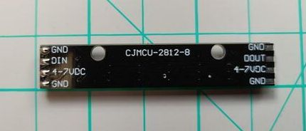
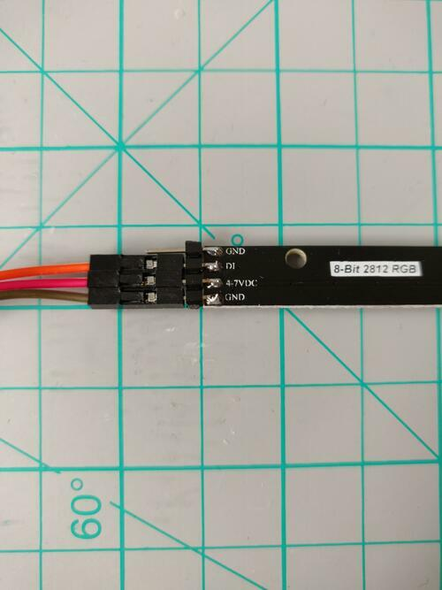
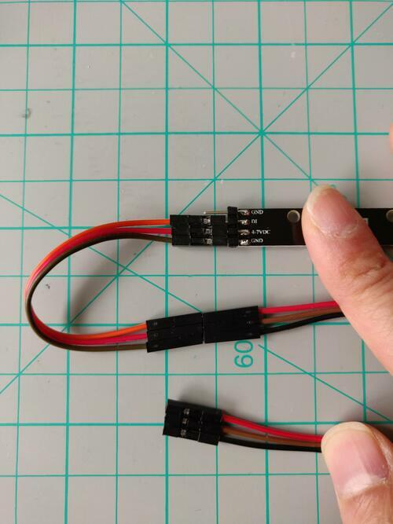
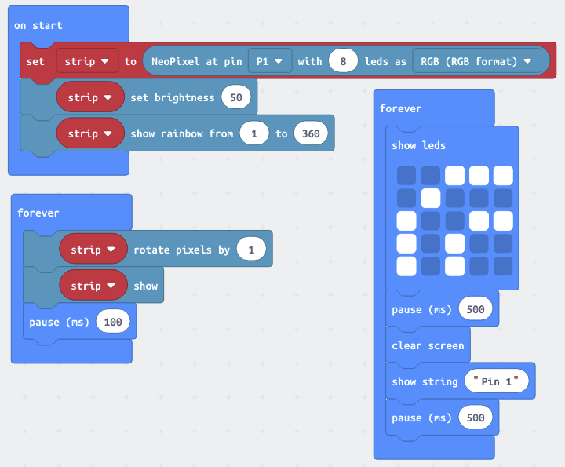

[//]: # "slide Markdown for remark"

class: center, middle

# micro:bit course

## Season 1 Lesson 6

## Motion Sensors

???
Speaker notes
_Markdown_ also available here

---

# 大綱

- Neopixel
- 被動紅外感測器 PIR
- 光敏電阻 LDR

---

class: img-100

# 擴展板

.row[
.col-6[

]

.col-6[

- .yellow-pin[黃色]是連到 micro:bit 作輸入/輸出用
- 所有.red-pin[紅色]都一樣是高電壓(3.3V)
- 所有.black-pin[黑色]都一樣是低電壓(GND/0V)

]
]

---

# 電子零件的使用

- 參考零件針腳圖 (Pinout)  
  有些零件會把針腳功能印在針腳旁
- +/3V/VCC: 連到擴展板任一個.red-pin[紅色]針
- -/GND: 連到擴展板任一個.black-pin[黑色]針
- 其他針腳: 連到擴展板.yellow-pin[黃色]針作輸入/輸出用  
  插到擴展板的那一支 Pin 要按針腳功能和程序匹配
- 如果零件只有 + 和 - 針腳而你想控制它的供電(例如 LED)  
  把 + 連到.yellow-pin[黃色]針

---

class: center, middle

# NeoPixel

---

# NeoPixel

.center[

]

- NeoPixel 的 5050 RGB LED 內建 WS2812B 控制器，可以把 LED 串聯起來
- 用 1 個針腳就能控制很多個 RGB LED
- DIN 是訊號輸入, 連接到.yellow-pin[黃色]針
- VCC 連接到.red-pin[紅色]針
- GND 連接到.black-pin[黑色]針
- 右邊是訊號輸出, 用來接到下一個 NeoPixel, 現在不用接線

---

class: img-100

# 材料

.row[

.col-6[

]
.col-6[

- micro:bit
- micro:bit 擴展板
- 母對母杜邦線 3 條 1 組  
  (亦可用 4 條 1 組的)
- NeoPixel

]
]

---

# Make

.blockquote[

```
認清對應每個針腳杜邦線的顏色
把母對母杜邦線的公頭插到 NeoPixel 的公頭
(用 4 條 1 組的話就懸空 1 條線)
杜邦線的另母頭就一整排插到 micro:bit 擴展板 Pin 1 的針上
佔著 Pin 1 一排的黃紅黑 3 針
```

]

---

class: img-100

.row[

.col-6[

]
.col-6[

認清對應每個針腳杜邦線的顏色

這個例子：

- DIN: 橙
- VCC: 紅
- GND: 啡

]
]

---

class: img-100

.row[

.col-6[

]
.col-6[

把母對母杜邦線的公頭插到 NeoPixel 的公頭  
(用 4 條 1 組的話就懸空 1 條線)

認清對應每個針腳杜邦線的顏色

這個例子：

- DIN: 橙 ⇨ 紅
- VCC: 紅 ⇨ 啡
- GND: 啡 ⇨ 黑

]
]

---

class: img-100

.row[

.col-6[

]
.col-6[

杜邦線的另母頭就一整排插到 micro:bit 擴展板 Pin 1 的針上  
佔著 Pin 1 一排的.yellow-pin[黃].red-pin[紅].black-pin[黑] 3 針

認清對應每個針腳杜邦線的顏色

這個例子：

- DIN: 橙 ⇨ 紅 ⇨ .yellow-pin[Pin 1]
- VCC: 紅 ⇨ 啡 ⇨ .red-pin[3.3V]
- GND: 啡 ⇨ 黑 ⇨ .black-pin[GND]

]
]

---

class: center, img-50


完成

---

class: img-100

# Code: 交通燈

.center[

]

.footnote[
[Program: traffic-light-neopixel](https://makecode.microbit.org/_XhRb7j1i3fAq)
]

---

class: img-75

# Code: 彩虹走馬燈

.center[

]

.footnote[
[Program: neopixel-8-rainbow](https://makecode.microbit.org/_dad1fC49CTt6)
]

---

class: center, middle

# 被動紅外感測器

---

# 電磁波 EM Waves

- 可見光是電磁波 (Electromagnetic Waves)  
  中人眼可見的一部份
- 電磁波有不同的頻率 (Frequency) 和波長 (Wavelength)
- 頻率越高, 能量越大, 波長亦越短

.img-100[

]

---

# 紅外線

- 溫度高的物體會發出紅外線 (Infrared)
- 越熱的物體發出的紅外線越強
- 人是溫血動物, 所以亦會發出紅外線

--

.center.img-50[

]

---

# 被動紅外感測器 PIR

- 被動: 感測器不會主動發出訊號
- PIR 在感應到紅外線高於它內定**閾值**時會輸出高電壓  
  紅外線源離開兩秒後輸出低電壓
- 閾值設置成探測人體溫度

* PIR 可以作為開關用在什麼地方呢?

---

class: img-100

# 材料

.row[

.col-6[

]
.col-6[

剛剛的 NeoPixel 加上

- 母對母杜邦線 3 條 1 組  
  (亦可用 4 條 1 組的)
- 被動紅外感測器 PIR

]
]

---

# Make

.blockquote[

```
把母對母杜邦線的公頭插到 PIR 的公頭
(用 4 條 1 組的話就懸空 1 條線)
認清對應每個針腳杜邦線的顏色
杜邦線的另母頭就一整排插到 micro:bit 擴展板 Pin 2 的針上
佔著 Pin 2 一排的黃紅黑 3 針
注意中間的輸出訊號線 (OUT) 和 VCC 要交換位置
```

]

---

class: img-100

.row[

.col-6[

]
.col-6[

把母對母杜邦線的公頭插到 PIR 的公頭  
(用 4 條 1 組的話就懸空 1 條線)

把 PIR 放成能看見板上的 `C1`, `U1`字樣  
認清對應每個針腳杜邦線的顏色

這個例子：

- VCC: 藍
- OUT: 紫
- GND: 灰

]
]

---

class: img-100

.row[

.col-6[

]
.col-6[

杜邦線的另母頭就一整排插到 micro:bit 擴展板 Pin 2 的針上  
佔著 Pin 2 一排的.yellow-pin[黃].red-pin[紅].black-pin[黑] 3 針  
_注意中間的輸出訊號線 (OUT) 和 VCC 要交換位置_

- VCC: 藍 ⇨ .red-pin[3.3V]
- OUT: 紫 ⇨ .yellow-pin[Pin 2]
- GND: 灰 ⇨ .black-pin[GND]

]
]

---

class: img-100

.row[

.col-6[

]
.col-6[

杜邦線的另母頭就一整排插到 micro:bit 擴展板 Pin 2 的針上  
佔著 Pin 2 一排的.yellow-pin[黃].red-pin[紅].black-pin[黑] 3 針  
_注意中間的輸出訊號線 (OUT) 和 VCC 要交換位置_

- VCC: 藍 ⇨ .red-pin[3.3V]
- OUT: 紫 ⇨ .yellow-pin[Pin 2]
- GND: 灰 ⇨ .black-pin[GND]

]
]

---

class: img-75

# Code: 小夜燈

.center[

]

.footnote[
[Program: night-light](https://makecode.microbit.org/_RkoX5gbwcF1L)
]

---

# 程序講解: 小夜燈

- 把手放到 PIR 前面, NeoPixel 會發光而 micro:bit 會顯示 1

.row[
.col-3[
`on start`
]
.col-9[

- 在 "Neopixel" 類別中創建`strip`變量  
  為 8 個 LED, RGB 格式的燈條
- 預設的亮度太光, 修改成 50
  ]

.col-3[
`forever`
]
.col-9[

- 檢查 Pin 2 的類比信號  
   PIR 的輸出較弱  
   不足以觸發 micro:bit 的數碼信號 1  
   所以用類比信號來判定
  ]
  ]

---

class: center, middle

# 光敏電阻 LDR

---

# 光敏電阻 LDR

- 光敏電阻 (Light Dependent Resistor)  
  在沒光的情況下阻力很大, 變成絕源體一樣  
  在有光的情況下阻力大大減小
- 為了方便使用, 我們的 LDR 零件
  - 光源低閾值時會輸出高電壓, 板上的 LED 滅
  - 光源高於閾值輸出低電壓, 板上的 LED 亮
  - 閾值可用零件上的**可變電阻**調教

* LDR 可以作為開關用在什麼地方呢?

---

class: img-100

# 材料

.row[

.col-6[

]
.col-6[

剛剛的 NeoPixel 加上

- 母對母杜邦線 3 條 1 組  
  (亦可用 4 條 1 組的)
- 光敏電阻 LDR

]
]

---

# Make

.blockquote[

```
把母對母杜邦線的公頭插到 LDR 的公頭
(用 4 條 1 組的話就懸空 1 條線)
認清對應每個針腳杜邦線的顏色
杜邦線的另母頭就一整排插到 micro:bit 擴展板 Pin 2 的針上
佔著 Pin 2 一排的黃紅黑 3 針
注意中間的 GND 和 VCC 要交換位置
```

]

---

class: img-100

.row[

.col-6[

]
.col-6[
把母對母杜邦線的公頭插到 LDR 的公頭  
(用 4 條 1 組的話就懸空 1 條線)

認清對應每個針腳杜邦線的顏色

這個例子：

- DO: 藍
- GND: 綠
- VCC: 黃

]
]

---

class: img-100

.row[

.col-6[

]
.col-6[

杜邦線的另母頭就一整排插到 micro:bit 擴展板 Pin 2 的針上  
佔著 Pin 2 一排的.yellow-pin[黃].red-pin[紅].black-pin[黑] 3 針  
_注意中間的 GND 和 VCC 要交換位置_

- DO: 藍 ⇨ .yellow-pin[Pin 2]
- GND: 綠 ⇨ .black-pin[GND]
- VCC: 黃 ⇨ .red-pin[3.3V]

]
]

---

class: img-100

.row[

.col-6[

]
.col-6[

杜邦線的另母頭就一整排插到 micro:bit 擴展板 Pin 2 的針上  
佔著 Pin 2 一排的.yellow-pin[黃].red-pin[紅].black-pin[黑] 3 針  
_注意中間的 GND 和 VCC 要交換位置_

- DO: 藍 ⇨ .yellow-pin[Pin 2]
- GND: 綠 ⇨ .black-pin[GND]
- VCC: 黃 ⇨ .red-pin[3.3V]

]
]

---

class: img-75

# Code: 小夜燈

.center[

]

.footnote[
[Program: night-light](https://makecode.microbit.org/_RkoX5gbwcF1L)
]

---

# 程序講解: 小夜燈

- 把手放到 LDR 前面阻擋光源  
  NeoPixel 會發光而 micro:bit 會顯示 1

.row[
.col-3[
`on start`
]
.col-9[

- 在 "Neopixel" 類別中創建`strip`變量  
  為 8 個 LED, RGB 格式的燈條
- 預設的亮度太光, 修改成 50
  ]

.col-3[
`forever`
]
.col-9[

- 檢查 Pin 2 的類比信號  
  我們亦可以檢查數碼信號為`1`  
  這裡跟 PIR 使用同一程序
  ]
  ]
