[//]: # "slide Markdown for remark"

class: center, middle

# Components List

---

# micro:bit 主板

.img-75.center[
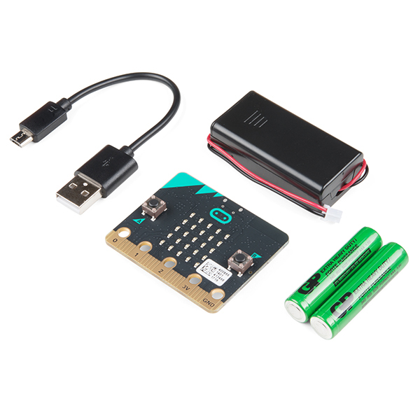
]

---

# Extension Board 擴展板

.img-75.center[

]

---

# micro:bit Case 外殼

.img-75.center[
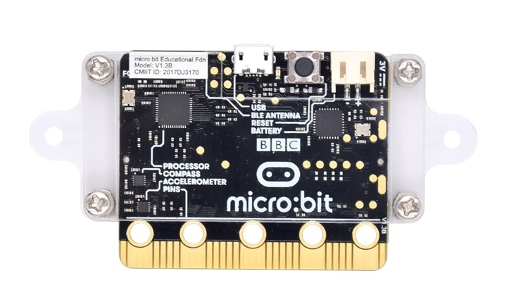
]

---

# Components Box 零件盒

.img-75.center[
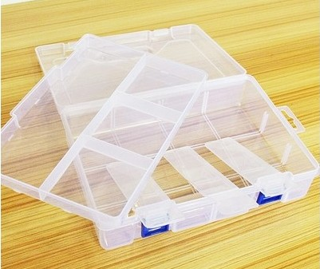
]

---

# Dupont Cables 杜邦線

.img-75.center[
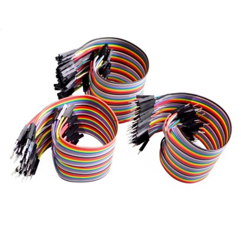
]
母對母 40 根  
公對母 40 根

---

# Breadboard 面包板

.img-75.center[
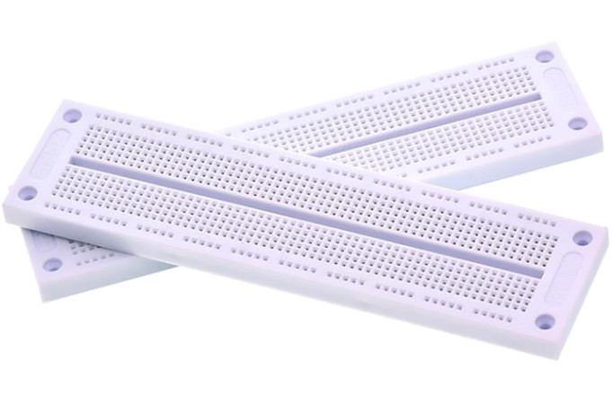
]

---

# Crocodile Clips 鱷魚夾

.img-100.center[
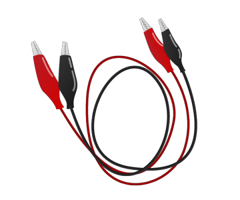
]
兩條

---

# Jump wires 跳線

.row[
.col-6[
.img-100[
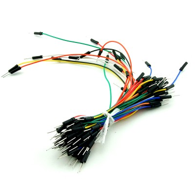
]
軟身 64 條
]
.col-6[
.img-100[
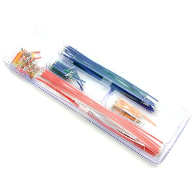
]
硬身 140 根
]
]

---

# Copper Tape 導電銅貼

.img-75.center[
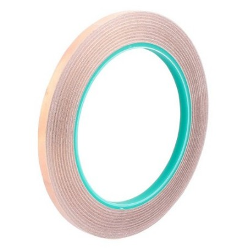
]
5mm\*25 米 (雙面導電)

---

# Resistors 電阻

.row[
.col-6[
.img-100[
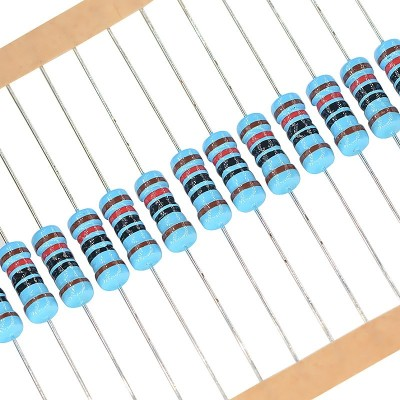
220Ω x10  
100Ω x10  
15Ω x10
]
]
.col-6[
.img-100[
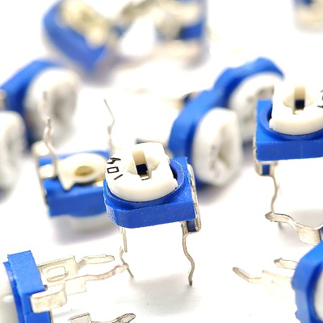
]
200Ω x2
]
]

---

# LDR 光敏電阻

.img-75.center[
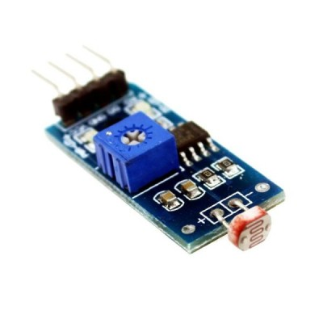
]

---

# LED

.row[
.col-6[
.img-100[
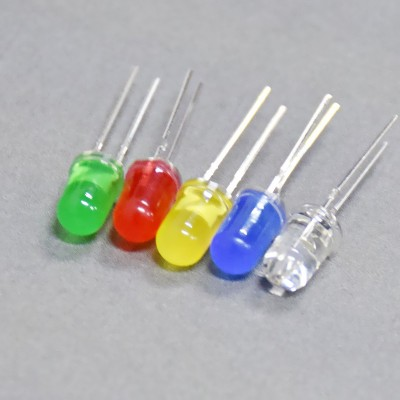
]
紅黃綠藍白 各 4 粒
]
.col-6[
.img-100[
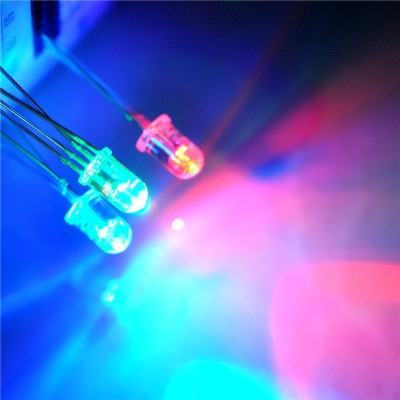
]
RGB LED 2 粒
]
]

---

# LED

.row[
.col-6[
.img-100[
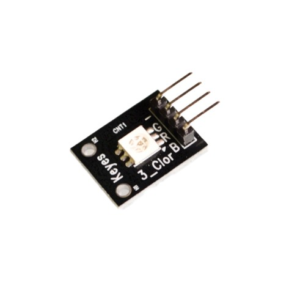
]
5050 RGB LED 板 1 塊
]
.col-6[
.img-100[
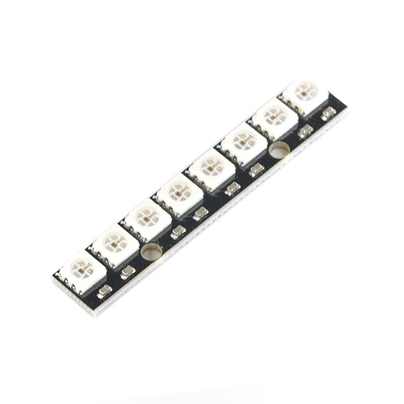
]
Neopixel 5050 RGB LED x8 1 塊
]
]

---

# Heart Beat Sensor 心跳感測器

.img-75.center[
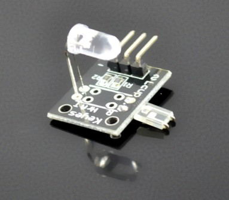
]

---

# PIR Sensor 被動紅外感測器

.img-75.center[
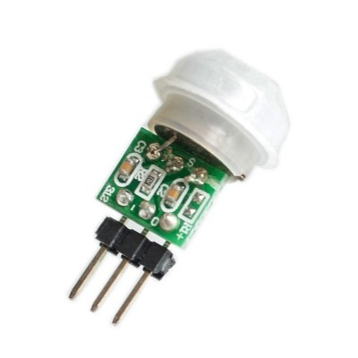
]

---

# Color Sensor 顏色感測器

.img-75.center[
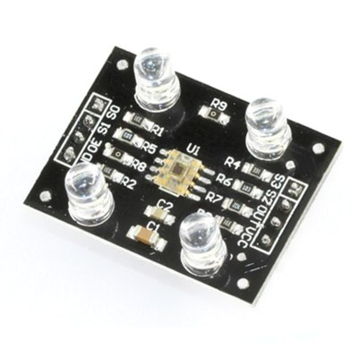
]

---

# RFID Reader 讀卡器

.img-75.center[
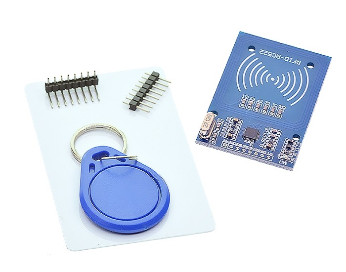
]

---

# Magnet 磁石

# Tape 透明膠紙

# A4 File

# Clay 泥膠
