[//]: # "slide Markdown for remark"

class: center, middle

# micro:bit course

## Basic Electronics

---

# Electric Vocabulary

.row[

.col-6[
.blockquote.primary[
.title[Electricity (電力)]
the flow of charge (電荷)
]
.blockquote.primary[
.title[Voltage (電壓)]
the energy per unit of charge, supplies the energy that creates the current
]
]

.col-6[
.blockquote.primary[
.title[Resistance (電阻)]
resists the flow of electricity
]
.blockquote.primary[
.title[Current (電流)]
amount of charges passing through a cross section per unit of time
]
]

]

.footnote[
[What is Electricity? - learn.sparkfun.com](https://learn.sparkfun.com/tutorials/what-is-electricity)  
[Voltage, Current, Resistance, and Ohm's Law - learn.sparkfun.com](https://learn.sparkfun.com/tutorials/voltage-current-resistance-and-ohms-law)
]

---

# Cartoon Illustration

.img-100.center[
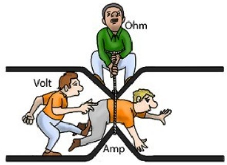
]

---

# Water Analogy

- Imagine we have a system of pump and pipes
  .row[
  .col-6.small[
- Voltage: energy source  
  pressure created by the pump
- Current: the flow of water  
   faster flow is higher current
  ]
  .col-6.small[
- Resistance:  
   the diameter of the pipe  
   the smaller the pipe, the higher the resistance
  ]
  ]

.img-100[
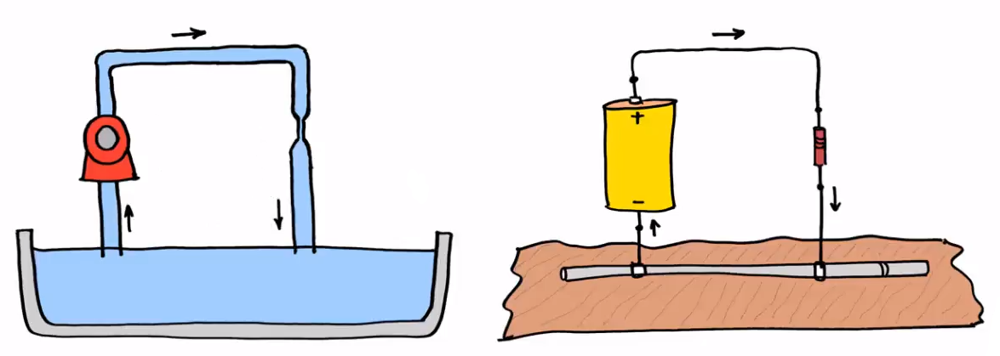
]

.footnote[
[Electric Circuits, Hydraulic Analogy: Charge, Voltage, and Current (introduction) - YouTube](https://www.youtube.com/watch?v=Lvp_a_JkD2o&list=PLaqfpQcOfMt6K5A2CauGxL5Y75hzld7-D)
]

---

# Water Analogy

- Imagine we have a system of pump and pipes
  .row[
  .col-6.small[
- Flow of water creates .red[**heat**] because of friction
- Flow of current creates .red[**heat**] because of resistance
  ]
  .col-6.small[
- High pressure will burst the pipe and ⇈ water flow
- High voltage will ⇊ the resistance and ⇈ current
  ]
  ]

.img-100[

]

.footnote[
[Electric Circuits, Hydraulic Analogy: Charge, Voltage, and Current (introduction) - YouTube](https://www.youtube.com/watch?v=Lvp_a_JkD2o&list=PLaqfpQcOfMt6K5A2CauGxL5Y75hzld7-D)
]

---

# Circuit

.blockquote.primary[
.title[Circuit (電路)]
The circular path which electricity flows
]

.footnote[
[What is a Circuit? - learn.sparkfun.com](https://learn.sparkfun.com/tutorials/what-is-a-circuit)  
[Switch Basics - learn.sparkfun.com](https://learn.sparkfun.com/tutorials/switch-basics)
]

---

# Some formula

- Voltage = Current × Resistance (`V = I × R`)
- Power = Voltage × Current (`P = V × I`)  
  `P = V × I = (I × R) × I = I² × R`
- both are in direct proportion (正比)
- power is also rate of energy transfer (energy ÷ time)

.footnote[
[Voltage, Current, Resistance, and Ohm's Law - learn.sparkfun.com](https://learn.sparkfun.com/tutorials/voltage-current-resistance-and-ohms-law)  
[Electric Power - learn.sparkfun.com](https://learn.sparkfun.com/tutorials/electric-power)  
]

---

# Some formula

- `V = I × R` and `P = V × I`
  .small[

| Entity            | Symbol | Unit                   |
| ----------------- | ------ | ---------------------- |
| Voltage (電壓)    | V      | Volt (V) (伏特)        |
| Current (電流)    | I      | Ampere (Amp, A) (安培) |
| Resistance (電阻) | R      | Ohm (Ω) (歐姆)         |
| Power (功率)      | P      | Watt (W) (瓦特)        |

]

.footnote[
The units are named after:  
.row[
.col-6[

- Italian physicist _Alessandro Volta_
- French physicist _André-Marie Ampère_
  ]
  .col-6[
- German physicist _Georg Ohm_
- Scottish engineer _James Watt_
  ]
  ]
  ]

---

# AC/DC

.center.img-50[
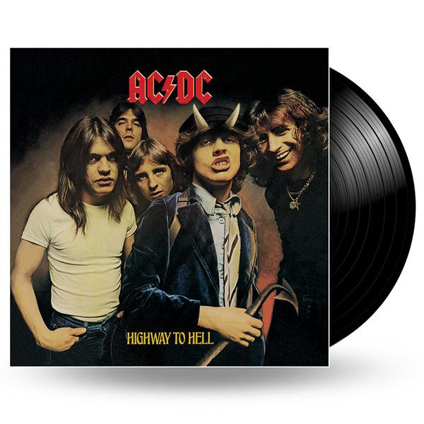
]

- not the famous rock band
- be explicit, use "alternating current" and "direct current" for searching

---

# AC/DC

.small[
.blockquote.primary[
.title[Alternating Current (AC) (交流電) ⏦]
Current and Voltage flow in the alternating direction in waveform pattern
]
.blockquote.primary[
.title[AC frequency (交流電頻率)]
Number of waveforms (cycles) in one second, measured in _Hertz (Hz)_
]
.blockquote.primary[
.title[Direct Current (DC) (直流電) ⎓]
Current and Voltage flow in the same direction with fixed value
]
]

.footnote[
[Alternating Current (AC) vs. Direct Current (DC) - learn.sparkfun.com](https://learn.sparkfun.com/tutorials/alternating-current-ac-vs-direct-current-dc)  
[Difference between AC and DC Current Explained | AddOhms #5 - YouTube](https://www.youtube.com/watch?v=vN9aR2wKv0U)  
]

---

# AC/DC

.center[
.img-50[
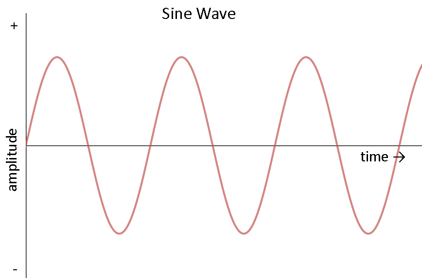
]

.img-50[
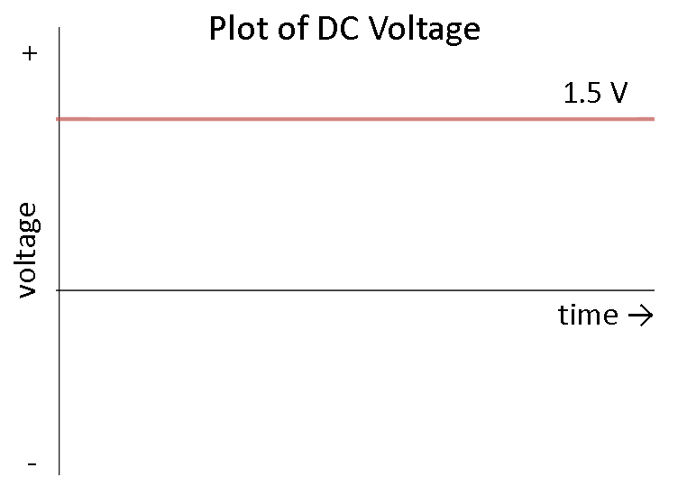
]
]

---

class: center, middle

# Check Your Appliances

---

# Nintendo Switch Adapter

.row[
.col-6[
.img-100[
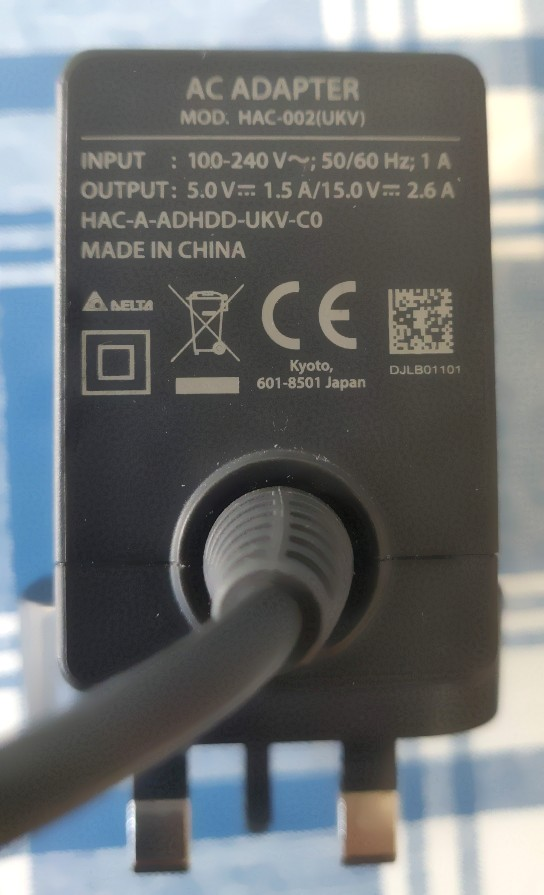
]
]
.col-6[

- `P = V × I`
- What's the power?
  ]
  ]

---

# Toshiba Laptop Adapter

.row[
.col-8[
.img-100[
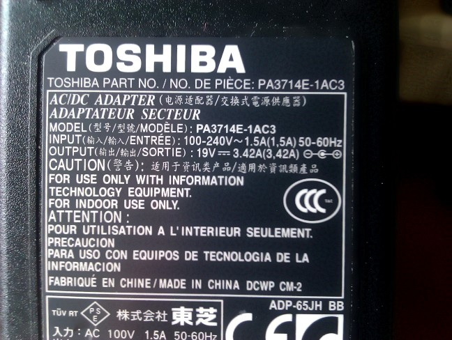
]
]
.col-4[

- `P = V × I`
- What's the power?
  ]
  ]

---

# Electric Kettle

.col-10[
.img-100[
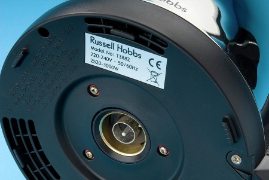
]
]

---

# Samsung TV 1

.col-10[
.img-100[
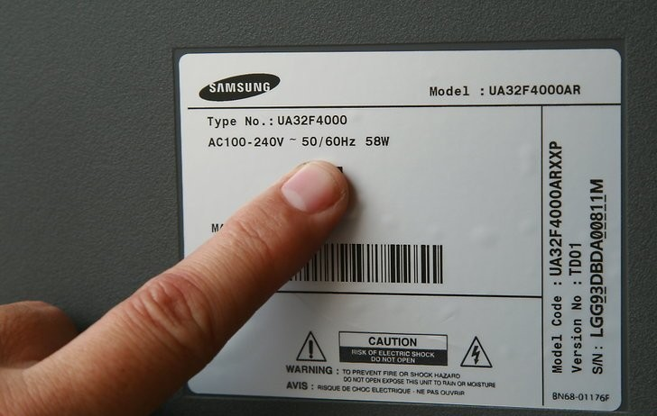
]
]

---

# Samsung TV 2

.col-10[
.img-100[
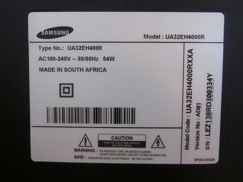
]
]

---

# Light Bulbs

.img-100[
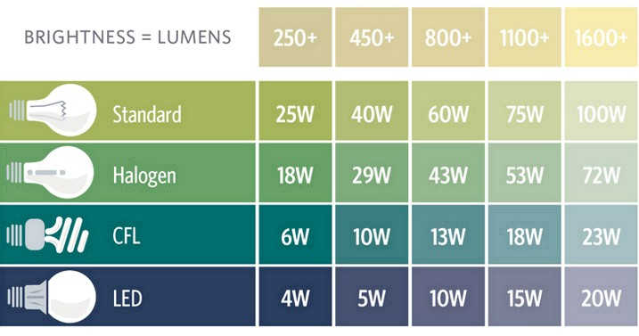
]

---

# Why AC?

- _Transmittion loss_
- remember `P(output) = V × I`
- more energy ⇒ ⇈ voltage or ⇈ current
- remember `P(loss) = (I × R) × I = I² × R`
- ⇈ current ⇒ ⇈ .red[heat] created by resistance of wire
- ⇈ voltage ⇒ ⇊ current ⇒ ⇊ heat ☺

---

class: center, middle

# Intermission: Metric Prefixes

---

# Electric Power Transmission

.col-10.offset-1[
.img-100[
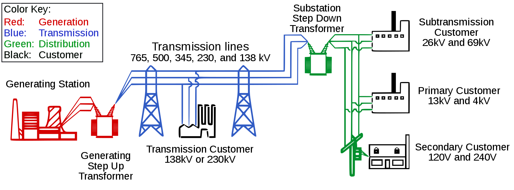
]

.img-50.center[
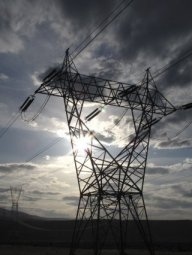

]
]

.footnote[
[Electric power transmission - Wikiwand](https://www.wikiwand.com/en/Electric_power_transmission)  
[香港的電力供應是如何煉成 - 發電站及變壓站 - YouTube](https://www.youtube.com/watch?v=KU3IlIdkEm0)
]

---

# High voltage kills

### touch with dry finger (1MΩ/1,000,000Ω)

|                    | DC           | 60Hz AC     |
| ------------------ | ------------ | ----------- |
| Slight sensation   | 0.6mA, 600V  | 0.3mA, 300V |
| Pain               | 41mA, 41000V | 6mA, 6000V  |
| Severe Pain        | 60mA, 6000V  | 15mA, 1500V |
| Heart Fibrillation | /            | 500mA, 50kV |

.footnote[
[Ohm’s Law (again!) | Electrical Safety | Electronics Textbook](https://www.allaboutcircuits.com/textbook/direct-current/chpt-3/ohms-law-again/)
]

---

# High voltage kills

### touch with wet finger (15kΩ/15,000Ω)

|                    | DC         | 60Hz AC      |
| ------------------ | ---------- | ------------ |
| Slight sensation   | 0.6mA, 9V  | 0.3mA, 4.5V  |
| Pain               | 41mA, 615V | 6mA, 90V     |
| Severe Pain        | 60mA, 900V | 15mA, 225V   |
| Heart Fibrillation | /          | 500mA, 7.5kV |

.footnote[
[Ohm’s Law (again!) | Electrical Safety | Electronics Textbook](https://www.allaboutcircuits.com/textbook/direct-current/chpt-3/ohms-law-again/)
]

---

# High voltage kills

.blockquote.warning[
.title[These figures are estimates only]
**DO NOT** imply it's save to touch power outlet with dry hands
]

.blockquote.danger[
.title[Never touch power source greater than   60V without insulation]
Unless in experiments under professional supervision
]

.blockquote.success[
This course will only use DC less than 12V
]

---

# Will birds get electrocuted?

- birds always stands on high voltage power cables

.img-100[
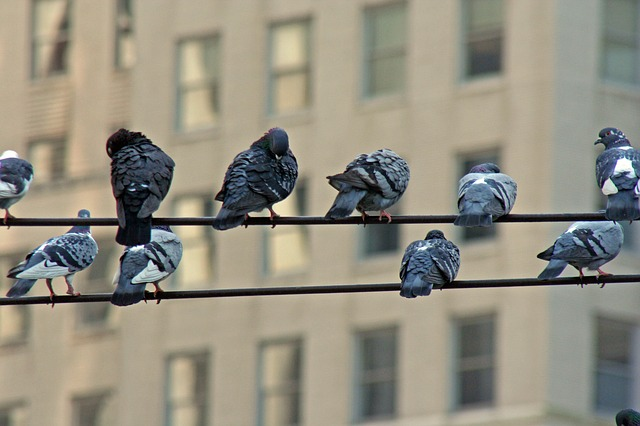
]
